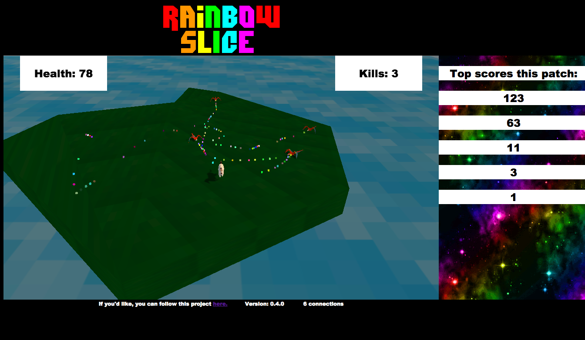

Rainbow_Slice
=============

To Run:
-------

* Run 'npm install -g'
* Link all modules with 'npm link [module-name]'
* Run 'node app' will expose localhost:8080

To Deploy:
----------

SSH to directory on deployment and 'git pull'

If there are any server changes, run 'bash stop' and 'bash start' scripts to reset the server

Licence:
--------

MIT
